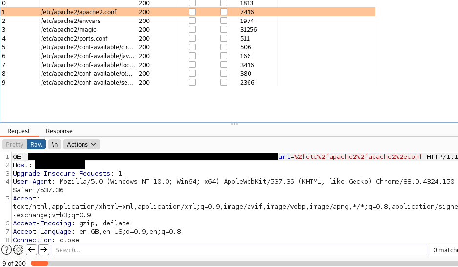
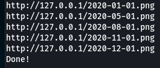

# /apache2-wordlist/wordlist.txt
Apache2 configuration wordlist for file inclusion attacks

# /automate
Contains apachesort.py which was used to create the wordlist and additional files

# /url
Contains existurl.py and installurl.py which are useful for boxes

